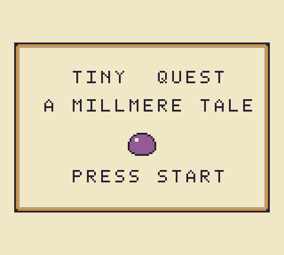
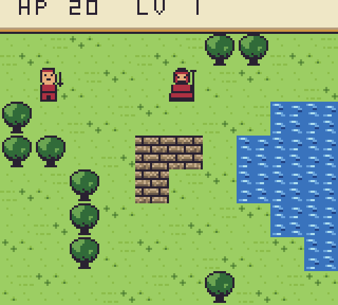
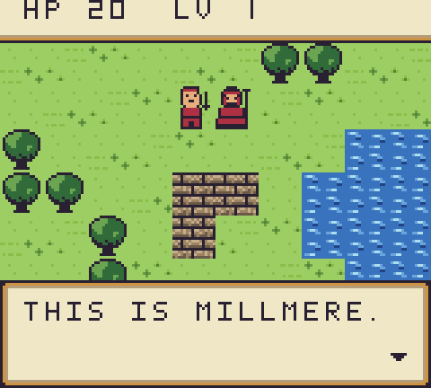
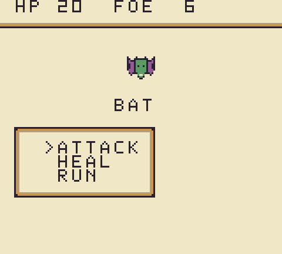

# gb-jrpg — the second north-star sample

A miniature **Game Boy Color-exclusive** JRPG written as ideal C# — boots to a **title screen**
(press Start), then explores the hand-designed **Millmere** overworld (a single-screen map with
a pond, organic shoreline, tree copses, a ruined mill wall, and a dead-end nook), talks to its
villager through paged dialogue, rolls random encounters into a menu-driven turn-based battle,
levels, victory and defeat — authored with no regard for what the compiler supported at the time,
per the ideal-code methodology of
[`docs/superpowers/specs/2026-07-19-ideal-game-api-design.md`](../../docs/superpowers/specs/2026-07-19-ideal-game-api-design.md).
It compiles unmodified; `dotnet build` emits `jrpg.gb` (header `0xC0` — CGB only, no monochrome
fallback), and `tests/Koh.Compiler.Tests/Samples/GbJrpgTests.cs` boots it on the emulator in CGB
mode and plays it through (walk → fight whatever the encounter roll throws at it → talk → dialogue
callback), capturing the acceptance screenshots below into [`screenshots/`](screenshots/).

| Title | Overworld | Dialogue | Battle |
|---|---|---|---|
|  |  |  |  |

Characters and monsters are 16×16 figures (2×2 tile blocks); the world walks on a 16×16 cell grid.

## The team polish pass

Art and design were produced by a team of specialized agents (level designer, terrain/character/monster/UI pixel artists) with visual review before acceptance. The seven PNG sheets under [`art/`](art/) now include terrain texture variants (4 grass, 2 wall, 2 water), a 2×2 tree block, and a classic double-line window-frame sheet driving all dialogue and menu windows. The enemy roster grew to four (Slime, Bat, Ghost, Drake) sharing one 4-color battle palette. The UI and battle scenes render on a parchment backdrop with framed windows, delivering a polished, cohesive aesthetic within the Game Boy's constraints.

## The gap catalog this game forced (each was a hard diagnostic when written)

| Construct in this game | What it forced |
|---|---|
| `static readonly byte[,] Map` + `Map[y, x]` through parameters (`World.cs`) | Rank-2 rectangular arrays: Roslyn emits `newobj T[0...,0...]::.ctor` and `Get`/`Set` calls on the array type (no CIL opcodes, no resolvable definitions); now laid out `[u16 d0][u16 d1][row-major payload]` with the reference at the payload, row stride read from payload−2 on untraceable arrays; ROM-folded for `static readonly` literals |
| `static readonly string[] Lines` dialogue table (`Actors.cs`) | `ldelem.ref`/`stelem.ref` — reference elements as 2-byte pointers |
| `new DialogueScene(Lines, () => ...)` — a stored `Action` close-callback invoked later through a field (`Scenes.cs`) | Enabler E3, stored delegates: a delegate crossing a provenance-erasing boundary materializes into a 3-byte arena blob `[u8 targetId][u16 env]`; an untraceable `Invoke` switches over the closed-world `CilDelegateRegistry` — direct calls only, and the traceable LINQ/lambda fast path unchanged |
| `interface IInteractable` on the villager, `Enemy` hierarchy with virtual stats | Already covered by M3's closed-world dispatch (sealed receivers devirtualize; the hierarchy tags handle the rest) |

## Art: the PNG tile pipeline (no tile bytes in source)

The sheets under [`art/`](art/) are ordinary PNGs (designed by a dedicated art pass, ≤4 colors
each). At build time the Koh SDK's `KohGenerateTileSheets` target converts them to 2bpp tiles and
generates `static class Art` — tile tables, counts, and each sheet's **actual colors as RGB555
constants**, so the CGB palettes are authored in the PNGs too. `Assets.cs` just loads sheets and
feeds `Art.*Color*` into `Palettes.SetBg`; per-terrain tile attributes (`Bg.SetAttr`) pick the
palette on CGB. The ROM is CGB-exclusive (header `0xC0`), so the dmgShades argument is vestigial.
